## About

Transitioned from audio engineering and commercial music production to software development. Currently **designing, building, deploying, and operating the full pipeline** for Unity-based commercial solutions as a solo developer. Primary stack: C#, C++, and Python, spanning **6 hardware native SDK integrations to Supabase-based deployment infrastructure**, working across every layer of the software. Reduced **CS cases by 60%** across approximately **1,000 kiosks** in production, and shortened the bug-fix cycle from **3 to 5 days down to same-day deployment**.

In parallel with commercial solution development and operations, leading a **game development team**. Focused on **architecture design and core framework refinement** that enable multiple developers to work concurrently, improving collaboration efficiency while growing in both **technical decision-making and team leadership**.

Software engineering, at its core, is about **defining problems and solving them through structure**. Striving to be a developer who delivers **measurable impact** to teams and organizations.

 

### Stats

 

